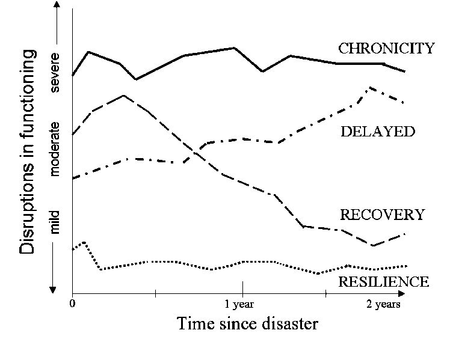
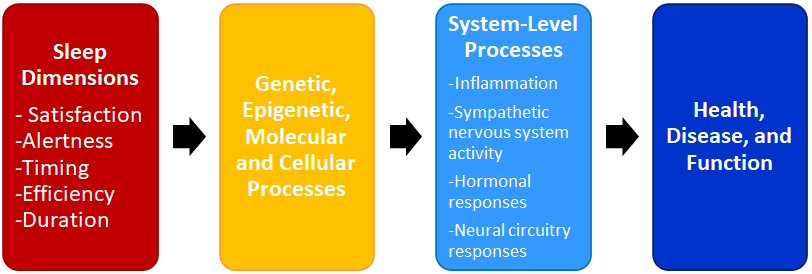

```{r setup, include=FALSE}
knitr::opts_chunk$set(echo = FALSE) 

library(tidyLPA)
library(dplyr)
library(sjPlot)
library(ggcorrplot)
library(knitr)
library(xtable)
library(apaTables)
library(broom)
library(ggplot2)
library(ggridges)
library(tibble)
library(nnet)

```

## About me

- Danica Slavish, Ph.D.

- Assistant Professor of Psychology

- Director of the Sleep and Health in Everyday Life Lab

## What is Latent Profile Analysis (LPA)?

- Identifies hidden clusters of people based on responses to multiple variables

- People across groups are unique, people within groups are similar

## What is LPA? (Obserski, 2015)

- "Mixture modeling is the art of unscrambling eggs: it recovers **hidden groups** from 
observed data."

{width=35%}

## Why use LPA?

- Useful for understanding complex behaviors or patterns

- Is a *set* of behaviors healthy? 


## LPA example: Posttraumatic stress (Bonanno, 2004)



## Why use LPA?

- Models probability of belonging to a profile 

- Superior to K-means approach, which uses distance algorithms


## 3-step approach (Bolck et al., 2004; Vermunt, 2010)

1. Build model

2. Examine model

3. Predict model

## Sleep is a multifaceted construct (Buysse, 2014) 



## Motivating example: Types of sleepers

- Are there different *types* of sleepers?

- What factors predict what type of sleeper someone is?


## Description of dataset
- 392 Dallas-area nurses

- 14 days of sleep surveys

- Sleep variables averaged across 14 days


## Indicator variables: Sleep dimensions

- **diary_TST_mean**: Sleep duration 

- **diary_CM_mean**: Circadian midpoint 

- **diary_SE_mean**: Sleep efficiency


## tidyLPA package (Rosenberg, 2020)

```{r, echo = T, results='hide', warning=F}

library(tidyLPA)

```

## Loading data

```{r, echo = T, results='hide', warning=F}

survey <- read.csv("https://bit.ly/3adVF7l")

```


## Latent Profile Analysis: 3 Classes

```{r, echo = T}
m3 <- survey %>%
    select(diary_TST_mean, 
           diary_CM_mean, 
           diary_SE_mean) %>%
    single_imputation() %>%
    scale() %>%
    estimate_profiles(3) 
```


## Latent Profile Analysis: Model Fit

- Classes = 3

- AIC = 2927.65    

- BIC = 2983.25     

- Entropy = 0.95    

- prob_min = 0.83    

- prob_max = 0.99

- n_min = 0.05 

- n_max = 0.76

- BLRT_p = 0.01


## Plotting the classes

```{r , echo = T, warning=F, out.width = '80%'}

plot_profiles(m3)

```

## Describing the classes

- **Class 1**: Short duration, normal timing, low efficiency 
  + (*"insomniacs"*)

- **Class 2**: Normal duration and efficiency, but late timing 
  + (*"night owls"*)  

- **Class 3**: Normal duration, timing, and efficiency 
  + (*"good sleepers"*)

## Comparing class solutions

```{r , echo = T, results='hide', warning=F}

m1_m3 <- survey %>%
    select(diary_TST_mean, 
           diary_CM_mean, 
           diary_SE_mean) %>%
    single_imputation() %>%
    estimate_profiles(1:3, 
              variances = c("equal", "varying"),
              covariances = c("zero", "varying")) %>%
    compare_solutions(statistics = c("AIC", "BIC"))

```

## Comparing class solutions

```{r , echo = T, warning=F}

m1_m3

```

## How do I decide on the number of classes?! (Ram & Grimm, 2009)

1. Look for errors, out-of-bound parameters, theoretical plausibility

2. Compare models using relative fit criteria (e.g., BIC, AIC)

3. Evaluate confidence people have been classified as belonging to one group vs. another (e.g., entropy)

4. Quantify comparisons between the model and a model with 1 less class using likelihood ratio tests

## Getting probability for 3 class solution

```{r, echo = T, out.width = "25%", warning=F}
data <- get_data(m3)

head(cbind(data$CPROB1,
           data$CPROB2,
           data$CPROB3))

```

## Appending probabilities to original dataset

```{r , echo = T, warning=F}

data <- data[,c("Class", 
                "CPROB1", 
                "CPROB2", 
                "CPROB3")]

classdata <- cbind(data,survey)

```

## Using variables to predict classes in multinomial regression
```{r , echo = T, results='hide', warning=F}

test <- multinom(Class ~ Age +
                         Female +
                         Stress +
                         Depression, 
                         data = classdata)

```


## Using variables to predict classes in multinomial regression
```{r , echo = T}

kable(tidy(test), digits = 2)


```

## Summary

- 3 profiles: 1) insomniacs, 2) night owls, 3) good sleepers

- Older age --> lower odds of being a "night owl"

- Older age --> lower odds of being a "good sleeper"

- Greater depression --> lower odds of being a "good sleeper" 

## Summary

- LPA is a powerful tool to determine underlying profiles of latent groups

- Can be extended to categorical variables (latent class analysis)


## Helpful resources

- [Bergman & Trost (2006). DOI: 10.1353/mpq.2006.0023](https://doi.org/10.1353/mpq.2006.0023)

- [Collins & Lanza (2010). DOI: 10.1002/9780470567333](https://onlinelibrary.wiley.com/doi/book/10.1002/9780470567333)

- [Spurk et al. (2020). DOI: 10.1016/j.jvb.2020.103445](https://doi.org/10.1016/j.jvb.2020.103445)

- [tidyLPA vignette](https://data-edu.github.io/tidyLPA/articles/Introduction_to_tidyLPA.html) 


## Contact

- Email: [danica.slavish@unt.edu](danica.slavish@unt.edu)

- Twitter: [danicaslavish](https://twitter.com/danicaslavish)

- Lab website: [sleep.unt.edu](https://psychology.unt.edu/sleep/)

{width=45%}